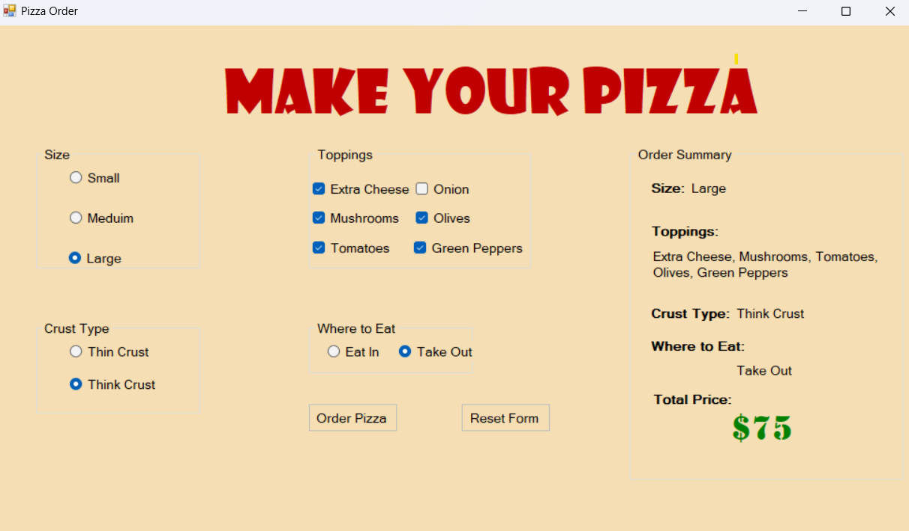

# 🍕 Pizza Order App

A simple desktop application built using **C# and Windows Forms** that allows users to create and order customized pizzas by selecting size, crust type, toppings, and dining option.

---

## 🖼️ Screenshot

---

## ✨ Features

- Select pizza **size**: Small, Medium, or Large
- Choose **crust type**: Thin or Thick
- Select from a variety of **toppings**: Extra Cheese, Mushrooms, Tomatoes, Onion, Olives, Green Peppers
- Choose where to eat: **Eat In** or **Take Out**
- Real-time **order summary** and **total price calculation**

---

## 🧠 Button Functions

- **Order Pizza**:
  - Confirms the order
  - Disables all inputs to prevent changes after ordering

- **Reset Form**:
  - Resets all selections to default values
  - Re-enables all controls so a new order can be placed

---

## 🛠️ Tech Stack

- **Language**: C#
- **Framework**: .NET Windows Forms
- **IDE**: Visual Studio

---

## 🚀 How to Run

1. Clone or download the repository
2. Open the solution file (`.sln`) in Visual Studio
3. Click **Start** or press `Ctrl + F5` to run the application

---

## 👨‍💻 Developed By

Mohamed Ramadan Wehebi  
- 🔗 [GitHub](https://github.com/mohamedramadan567) 
- 🔗 [LinkedIn](https://www.linkedin.com/in/mohamed-ramadan-732a82287/)